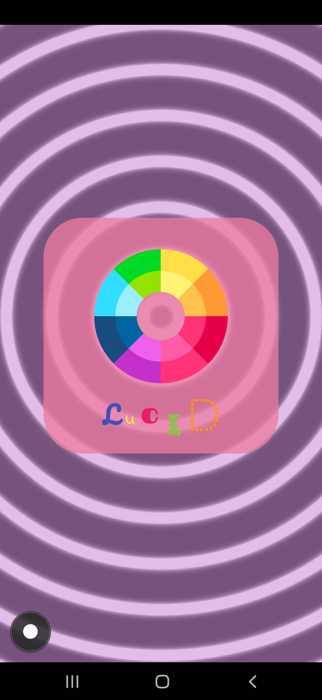
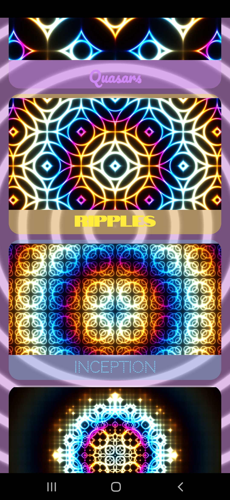

# Lucid

- Lucid is an application combines GLSL shaders to generate captivating visual effects and music. 
- It provides an immersive experience by integrating shader modules with an audio track. 

## CREDIT
- I am not a expert shader programmer. I really watched a video by @kishimisu on Youtube on how to start with shader programming
- Also I looked at some of the resources mentioned in the video
- One of the shaders is based on the one used by @kishimisu in the Youtube video

## Video Tutorial by @kishimisu
- `Getting started with shader programming` - https://www.youtube.com/watch?v=f4s1h2YETNY

## App Demo
 - `Lucid App Demo` - https://www.youtube.com/watch?v=tm-JIWl1koc&ab_channel=Tendai&themeRefresh=1

## Table of Contents
- [Overview](#overview)
- [Features](#features)
- [Key Components](#key-components)

## Overview

- Lucid is designed to create mesmerizing visual effects using GLSL shaders and synchronize these visuals. 
- The app provides a user-friendly interface to navigate through different shader modules.

## Features

- **GLSL Shaders:** Lucid utilizes GLSL (OpenGL Shading Language) shaders to generate stunning visual effects.

- **Music Integration:** The app plays an audio track, enhancing the overall experience.

- **Shader Modules:** Lucid offers a selection of shader modules to explore.

- **Interactive Interface:** Users can switch between different shader modules using an intuitive menu.

- **Full-Screen Experience:** Lucid provides an immersive, full-screen experience for the best visual and auditory experience.

## Key Components

### 1. `MenuActivity`
The `MenuActivity` is the app's main menu. It displays a grid of available shader modules, allowing users to select and view each module's unique visuals. Here's an overview of its key components:

- WebView for rendering visuals.
- MediaPlayer for playing the audio track.

### 2. `SplashActivity`
The `SplashActivity` serves as the app's splash screen, displaying initial visuals and music. It transitions to the `MenuActivity` after a predefined duration. Key components of this activity include:

### 3. `ViewerActivity`
The `ViewerActivity` displays the visuals and music for selected shader modules. It receives the chosen module and playback position as intent data and initializes the WebView and MediaPlayer accordingly. Key components include:

- WebView for rendering visuals.
- MediaPlayer for playing the audio track.
- Intent data to determine the selected shader module and playback position.

### NOTE: Images are in the `img` folder
